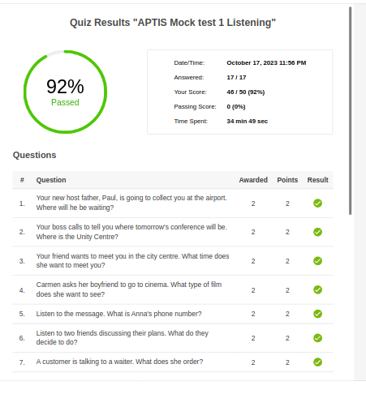
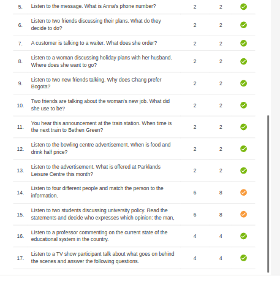

***
# SESSIONS WITH MARTA
***
***
***
***
# 17-10-23 Presentation and starting

### My pre-session guide. "to-talk":

- Resources (I'm following brittish council learn english web).
- Exam models.
- Next sessions: when? how many? Budget 100$. Focus on speaking, I think is the part of the learning path that is more difficult for me, because i never have the opportunity to practice. (writing, reading, listening, grammar and vocabulary with resources and chatGpt)

***

### My Session notes

- Talk about people saying adjectives and describing them. One tactic for the exam is to learn three or four descriptions of people and use always the same, wheter is my aunt Pepito or Lola Flores.
***

### Marta's session Notes

- **Adjectives for description**

    Taller - Shorter

    Older - Younger

    Smart, clever, intelligent.

    Funny, bad-ass (US), nice, interesting, nervous.

- **Grammar**

    **Like / Love / Enjoy / Hate + verb-ing / (to + verb)**

    (Example: I love walking my dog.) (more points!)

    **Like / Love / Enjoy / Hate + noun**

    (Example: I hate pizza)

- **Describing a photo**

    *This photo shows / In this picture we can see…* 

    1 ***General Idea***

    2 ***Place***: Outdoors? Indoors? Room? Daylight? Night? Seasons? Furniture?

    3 ***People***: Number of people? Age (teenagers/children/in her twenties)? Relatives? Couple?

    4 ***Actions***

    5 ***Feelings***: focused, motivated, excited, etc

    (6 ***Clothes***) (if there's time)

    GUESSING (In all the description, the general tone is guessing): Maybe / Probably / Perhaps

- **Comparing photos**

Similarities / Differences
***

# Aptis Mock Test 1
### Listening

- Tactics: I must remember don't waisting my time listening easy questions two times. Take a little risk! Don't double-check things like "is orange the color of an orange?". In this Mock test I had a little time to answer the last four or five questions. I need time to be calm and have the possibility to read the info before listening in these last questions.
- Doubts: Is it possible to repeat the same answer in two options of the same question? (case question14).

